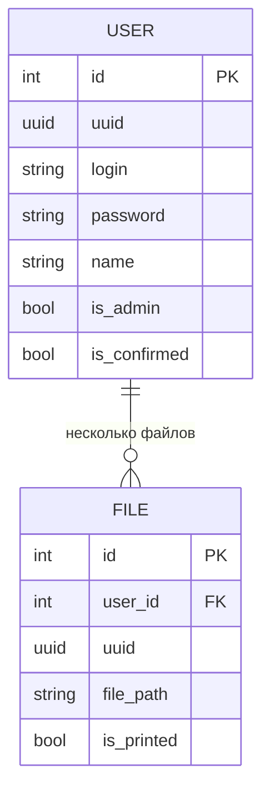

# 57project
## Функционал:

- Регистрация в 2 формах(админ и обычный пользователь):
  - обычный пользователь: регистрация одобряется админом
  - админ: должен ввести специальный ключ(например)

- Печать файлов:
  - пользователь(и админ, и обычный пользователь) закидывает файл, и он автоматически печатается.
  - можно запросить список напечатанных или ненапечатанных файлов

## User  story:
- Пользователь: <br />
  Как пользователь без прямого доступа к принтеру, я хочу печать файлы, не подходя к принтеру, чтобы не делать лишние действия по пересылке файлов на компьютер, подключенный к принтеру.

- Пользователь: <br />
  Как новый пользователь, я хочу зарегистрироваться в системе, чтобы получить доступ к функционалу сервиса.

- Администратор: <br />
  Как администратор, я хочу поддерживать сервис в рабочем состоянии, модерировать пользователей, чтобы система работала стабильно и незнакомые люди не печатали на моем принтере.

- Администратор: <br />
  Как администратор, я хочу зарегистрироваться в системе, чтобы получить возможность контролировать сервис и добавлять новых пользователей.

- Пользователь и администратор: <br />
  Как пользователь или администратор, я хочу получить историю напечатанных ранее файлов, чтобы найти файл, который я потерял.

- Пользователь и администратор: <br />
  Как пользователь или администратор, я хочу получить список ненапечатанных файлов, чтобы иметь возможность попробовать его снова напечатать.

## Sequence диаграмма


## C1 диаграмма


## C2 диаграмма


## Схема сущностей БД


## DDL
```sql
CREATE TABLE users
(
    id            SERIAL PRIMARY KEY,
    uuid          UUID                NOT NULL,
    login         VARCHAR(255)        NOT NULL,
    password      VARCHAR(255)        NOT NULL,
    name          VARCHAR(255),
    is_admin      BOOLEAN             NOT NULL DEFAULT FALSE,
    is_confirmed  BOOLEAN             NOT NULL DEFAULT FALSE
);

CREATE TABLE files
(
    id            SERIAL PRIMARY KEY,
    user_id       BIGINT              NOT NULL REFERENCES users,
    uuid          UUID                NOT NULL,
    file_path     VARCHAR(255)        NOT NULL,
    is_printed    BOOLEAN             NOT NULL DEFAULT FALSE
);

```